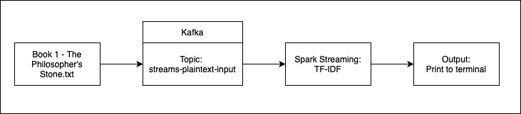

# Calculate realtime TF-TDF 

## Task
Read book and calculate realtime TF-IDF using Kafka and Spark Streaming

## Kafka
Install and setup Kafka by follow [kafka-quickstart-workshop](https://github.com/IBM/kafka-quickstart-workshop)

## Scripts
- `1_start_cluster.sh` Start zookeeper and Kafka
- `2_create_streams_plaintext_input.sh` Create streams-plaintext-input topic
- `3_spark_submit_tdidf.sh` Submit spark job for calculate TD-TDF
- `4_run_python_producer-local.sh` Execute `scripts\producer-local.py`. Read book and producer send text to streams_plaintext_input topic
- `scripts/tfidf.py` Consume data from streams-plaintext-input topic and calculate TF-IDF
