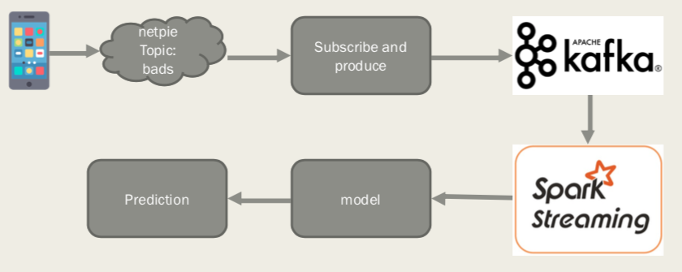
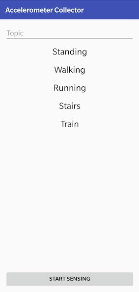
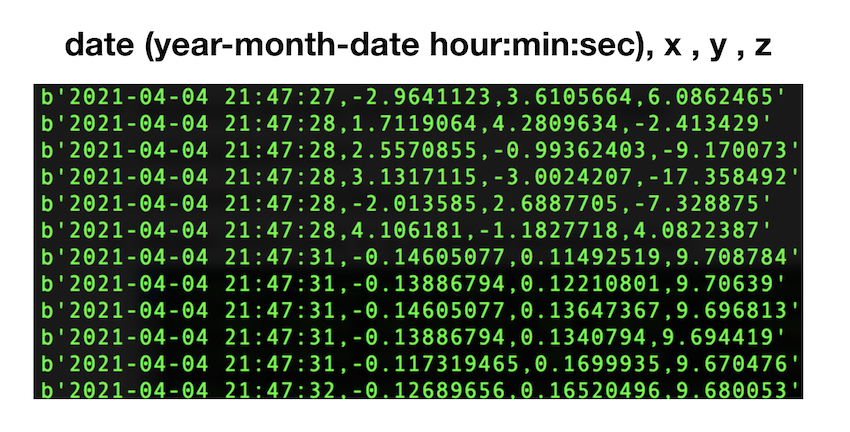
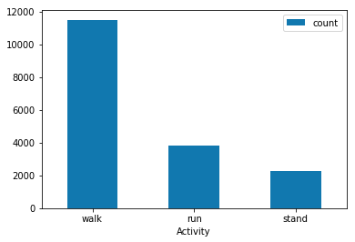
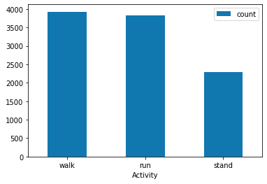
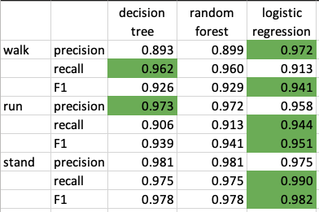
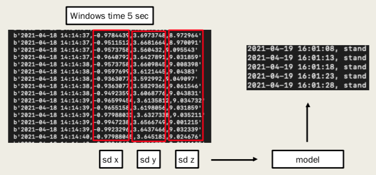

# Predict real-time human activity 
Predict real-time human activity(stand, walk, run) using an accelerometer in a smartphone

1. The data from an accelerometer published to MQTT Broker.
2. Subscriber consumed data from MQTT Broker and published to Kafka.
3. Kafka sent data to Spark Streaming job.
4. Spark Streaming job apply data to model for predict activity(stand, walk, run)

## Andriod App

app-debug.apk is andriod application for collect data from an accelerometer sensor in a smartphone. After press 'start sensing', the data from an accelerometer published to MQTT Broker on [netpie.io](netpie.io) in realtime. After press 'stop sensing', the data stop published to MQTT Broker and save data as CSV file on your device.

*Note* This app develop by [Dr.Ekarat](https://github.com/ekaratnida)

## Dataset
Data from app consist of date, x, y, z (axis of accelerometer)

## Feature Engineering
Compute Standard Deviation (SD) of X, Y, Z every 15 row using [CreateActivityData.ipynb](./preparing/CreateActivityData.ipynb)
The result consist of sd of x, sd of y, sd of z, activity(stand, walk, run)

## Unbalance Data

 

After preparing data, the data have an unbalanced data class. I undersample data class walk to fix an unbalanced data class.

## Training Model
I use features sd of x, sd of y, and sd of z, and label activity(stand, walk, run) with Decision Tree, Random Forest, and Logistic Regression using PySpark

## Model Performance

The Logistic Regression Model gives the best f1-score in every class.

## Realtime Preidction
I select Windows time = 5 sec. Every 5 second, spark job compute Standard Deviation of 3 axes of incoming data and apply it to model for predict activity in real-time.

